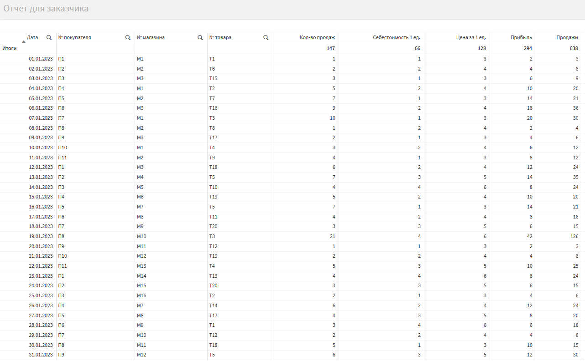

# Аналитический дашборд в Qlik Sense: Учебный кейс (DEV/BA)

Этот репозиторий содержит решение тестового задания по Qlik Sense.

## Описание проекта

Целью проекта было создание аналитического приложения на основе предоставленных данных о продажах. Работа включает в себя:
- Загрузку и очистку данных из Excel.
- Построение модели данных типа "Звезда".
- Создание расчетных полей и агрегированных таблиц в скрипте загрузки.
- Применение фильтрации для создания отдельных аналитических витрин.
- Формирование финального отчета и его сверку с эталонными данными.

## Технологии
- Qlik Sense Desktop

## Структура репозитория
- `/data`: Исходный Excel-файл с данными.
- `/solution`: Готовое приложение Qlik Sense (`.qvf`).
- `/documentation`: Подробный отчет о выполненной работе в формате `.docx` и скриншоты.

## Как использовать
Для просмотра результата необходимо импортировать файл `solution/Задание по QS.qvf` в Qlik Sense Desktop или Qlik Sense Enterprise.

## Результат
